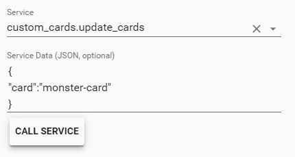

# custom_component to update custom_cards

A component which allows you to update your custom_cards automatically or with service `custom_cards.update_cards`.

⚠️ For now this wil ONLY work if your cards if from https://github.com/ciotlosm/custom-lovelace


## Installation
To get started put `/custom_components/custom_cards.py`  
here: `<config directory>/custom_components/custom_cards.py`  
  


## Configuration
  
| key | default | required | description
| --- | --- | --- | ---
| **auto_update** | False | no | Activate auto update of custom_cards, can be `True`/`False`

☢️ It is strongly adviced to not have this auto update

## Example

In your `configuration.yaml`:

```yaml
custom_cards:
  auto_update: False
```

## Debug logging

In your `configuration.yaml`

```yaml
logger:
  default: warn
  logs:
    custom_components.custom_cards: debug
```

## Update single card

You can update a single card by passing which card you want to update to the  `custom_cards.update_cards` service.

### From dev-service



Service:
`custom_cards.update_cards`

Service Data:

```json
{
  "card":"monster-card"
}
```
